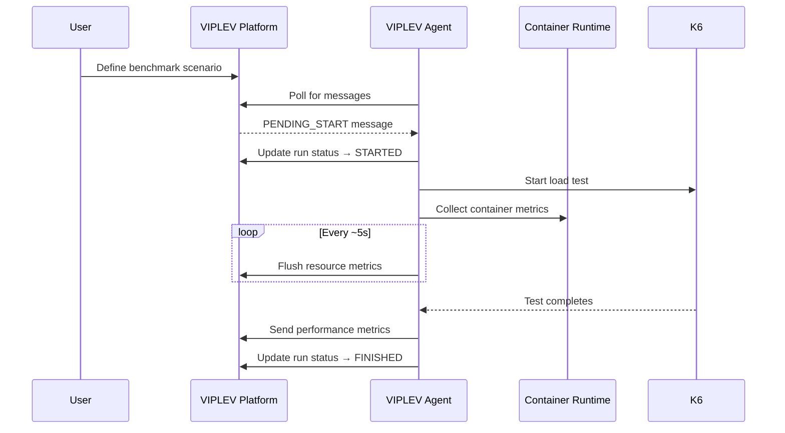
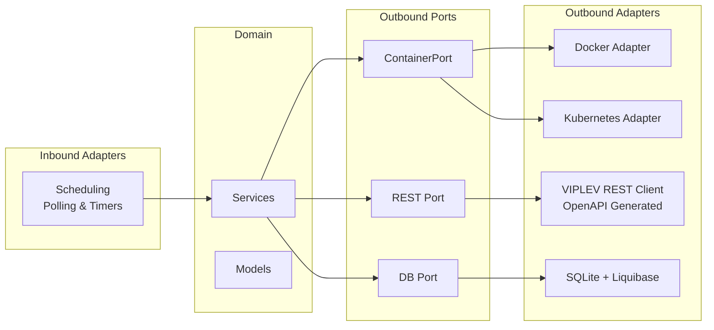
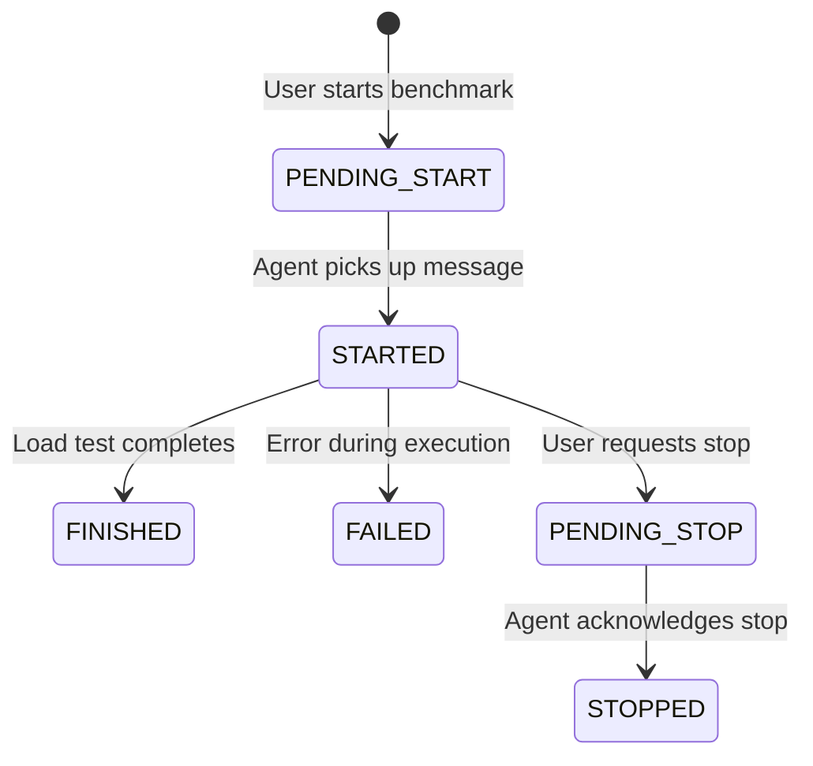

# VIPLEV Agent

A lightweight agent deployed into the environment being benchmarked. It communicates with the [VIPLEV](https://github.com/viplev/viplev) platform via REST API, receives benchmark instructions, and executes them by managing containers and running [K6](https://k6.io/) load tests. Resource and performance metrics are continuously collected and reported back to VIPLEV.

## Communication Flow



## Architecture

The project follows **hexagonal architecture** (ports & adapters). Domain logic is isolated from infrastructure through port interfaces. Adapters implement those ports for specific technologies (Docker, Kubernetes, REST, SQLite), making them independently swappable.



## Package Structure

```
src/main/java/dk/viplev/agent/
├── AgentApplication.java              # Spring Boot entry point
├── adapter/
│   ├── inbound/
│   │   └── scheduling/                # Scheduled polling and timer jobs
│   └── outbound/
│       ├── container/
│       │   ├── docker/                # Docker runtime adapter (@Profile("docker"))
│       │   └── kubernetes/            # Kubernetes runtime adapter (@Profile("kubernetes"))
│       └── rest/                      # VIPLEV API client (wraps generated OpenAPI code)
├── config/                            # Spring configuration beans
├── domain/
│   ├── exception/                     # Domain-specific exceptions
│   ├── model/                         # Domain entities and value objects
│   └── services/                      # Core business logic
└── port/
    ├── inbound/                       # Inbound use-case interfaces
    └── outbound/
        ├── container/                 # ContainerPort interface
        ├── db/                        # Database port interface
        └── rest/                      # REST client port interface
```

## Agent Lifecycle

### Startup

The agent authenticates with VIPLEV using `VIPLEV_TOKEN`, discovers all running containers via the container runtime, and registers the host and its services with VIPLEV (`POST /environments/{id}/services`).

### Idle

Polls `GET /environments/{id}/message` every **~15 seconds** for pending benchmark instructions. Simultaneously watches Docker events to keep the service registration up to date when containers start or stop.

### Active Run

When a `PENDING_START` message arrives, the agent:
1. Transitions the run to `STARTED`
2. Increases poll frequency to **~5 seconds**
3. Starts collecting resource metrics every **~1 second**
4. Flushes buffered metrics to VIPLEV every **~5 seconds**
5. Executes the K6 load test script
6. On completion, sends performance metrics and transitions to `FINISHED`

### Shutdown

Flushes any buffered metrics, updates active runs to `FAILED` (with reason) if interrupted, and exits gracefully.

## Run Status State Machine



The agent can set a run to `STARTED`, `FINISHED`, `FAILED`, or `STOPPED`. The states `PENDING_START` and `PENDING_STOP` are set by the VIPLEV platform.

## Configuration

| Variable | Default | Required | Description |
|---|---|---|---|
| `VIPLEV_URL` | `http://localhost:8080` | No | Base URL of the VIPLEV platform API |
| `VIPLEV_TOKEN` | *(none)* | Yes | Bearer token for agent authentication |
| `VIPLEV_ENVIRONMENT_ID` | *(none)* | Yes | UUID of the environment this agent belongs to |
| `VIPLEV_RUNTIME` | `docker` | No | Container runtime profile: `docker` or `kubernetes` |

These map to Spring properties `viplev.url`, `viplev.token`, `viplev.environment-id`, and `spring.profiles.active` in `application.properties`.

## Build, Run, and Test

### Prerequisites

- Java 21 (managed via Gradle [toolchain](https://docs.gradle.org/current/userguide/toolchains.html))
- Docker (required for the `docker` runtime profile)

### Common Commands

```bash
# Start the application locally
./gradlew bootRun

# Run all tests
./gradlew test

# Compile without running tests
./gradlew classes

# Full build (compile + test + jar)
./gradlew build

# Build only the boot jar (output: build/libs/viplev-agent.jar)
./gradlew bootJar
```

### Cleanup and Troubleshooting

```bash
# Delete build output
./gradlew clean

# Clean build from scratch
./gradlew clean build

# List all available tasks
./gradlew tasks

# Show dependency tree (useful for finding version conflicts)
./gradlew dependencies

# Run build with debug output
./gradlew build --info
```

## Docker Deployment

```bash
docker run -d \
  --name viplev-agent \
  -e VIPLEV_URL=https://viplev.example.com \
  -e VIPLEV_TOKEN=<token-from-viplev> \
  -e VIPLEV_ENVIRONMENT_ID=<environment-uuid> \
  -v /var/run/docker.sock:/var/run/docker.sock \
  ghcr.io/viplev/agent:latest
```

Mounting the Docker socket is required for the agent to discover and monitor containers. For Kubernetes, the agent runs as a pod with a ServiceAccount that has appropriate RBAC permissions.

Or with Docker Compose:

```bash
docker compose up -d
```

## Commit Message Convention

This project uses [Conventional Commits](https://www.conventionalcommits.org/) and [semantic-release](https://github.com/semantic-release/semantic-release) for automated versioning and changelog generation.

### Format

```
<type>(<optional scope>): <description>

<optional body>

<optional footer>
```

### Types

| Type | Description | Version bump |
|------|-------------|--------------|
| `feat` | New feature or functionality | Minor |
| `fix` | Bug fix | Patch |
| `docs` | Documentation only | None |
| `chore` | Build, CI, tooling, dependencies | None |
| `refactor` | Code change that neither fixes a bug nor adds a feature | None |
| `test` | Adding or updating tests | None |
| `perf` | Performance improvement | Patch |

A commit with `BREAKING CHANGE:` in the footer (or `!` after the type) triggers a **major** version bump.

### Examples

```
feat: add container monitoring endpoint
fix: correct Docker socket permissions
docs: update README with commit conventions
chore: upgrade Spring Boot to 3.5.13
refactor(monitoring): extract metrics collection to separate service
feat!: change agent polling API response format
```

### Pull Requests

- PR title must follow the same Conventional Commits format — it becomes the merge commit message
- Keep the title short (under 72 characters), use the description for details
- PR description should include:
  - **Summary** — what changed and why (2-3 bullet points)
  - **Test plan** — how to verify the changes
